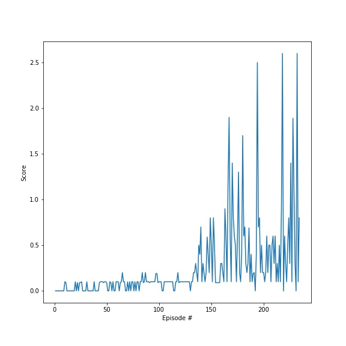

# Report
This document contains my report for the Udacity `Collaboration and Competition` project. It includes the project goal, environment, learning algorithm, results and ideas for future work

## The Goal

In this environment, two agents control rackets to bounce a ball over a net. If an agent hits the ball over the net, it receives a reward of +0.1. 
If an agent lets a ball hit the ground or hits the ball out of bounds, it receives a reward of -0.01. Thus, the goal of each agent is to keep the ball in play.

## The Environment

The observation space consists of 8 variables corresponding to the position and velocity of the ball and racket. 
Each agent receives its own, local observation. Two continuous actions are available, corresponding to movement toward (or away from) the net, and jumping.

The task is episodic, and in order to solve the environment, your agents must get an average score of +0.5 (over 100 consecutive episodes, after taking the maximum over both agents). Specifically,

After each episode, we add up the rewards that each agent received (without discounting), to get a score for each agent. This yields 2 (potentially different) scores. We then take the maximum of these 2 scores.
This yields a single score for each episode.
The environment is considered solved, when the average (over 100 episodes) of those scores is at least +0.5.


## The Learning Algorithm
The agent is trained using the *Multi Agent Deep Deterministic Policy Gradient* algorithm.
> MADDPG, or Multi-agent DDPG, extends DDPG into a multi-agent policy gradient algorithm where decentralized agents learn a centralized critic based on the observations and actions of all agents. 
> It leads to learned policies that only use local information (i.e. their own observations) at execution time, does not assume a differentiable model of the environment dynamics or any particular 
> structure on the communication method between agents, and is applicable not only to cooperative interaction but to competitive or mixed interaction involving both physical and communicative behavior. 
> The critic is augmented with extra information about the policies of other agents, while the actor only has access to local information. After training is completed, only the local actors are used 
> at execution phase, acting in a decentralized manner.

The algorithm is further described in [Multi-Agent Actor-Critic for Mixed Cooperative-Competitive Environments](https://arxiv.org/pdf/1706.02275.pdf).

### Model architecture

**Actor Neural Network**
The architecture includes:
- _Input size_ of **24**
- _Output size_ of **2**
- 3 fully connected hidden layers
- A relu activation function

*Critic Neural Network*
The architecture includes:
- _Input size_ of **24**
- _Output size_ of **1**
- 3 fully connected hidden layers
- A relu activation function


### Hyper parameters
|                                            |                                          |
| :----------------------------------------- | :--------------------------------------- |
| <p align="left">BUFFER_SIZE</p>            | <p align="left">1e6</p>                  |
| <p align="left">BATCH_SIZE</p>             | <p align="left">256</p>                  |
| <p align="left">GAMMA</p>                  | <p align="left">0.99</p>                 |
| <p align="left">TAU</p>                    | <p align="left">1e-3</p>                 |
| <p align="left">LR_ACTOR</p>               | <p align="left">1e-3</p>                 |
| <p align="left">LR_CRITIC</p>              | <p align="left">1e-3</p>                 |
| <p align="left">WEIGHT_DECAY</p>           | <p align="left">0</p>                    |
| <p align="left">UPDATE_EVERY</p>           | <p align="left">1</p>                    |
| <p align="left">UPDATE_NUMBER</p>          | <p align="left">3</p>                    |
| <p align="left">EPSILON</p>                | <p align="left">1.0</p>                  |
| <p align="left">EPSILON_DECAY</p>          | <p align="left">0.99</p>                 |
| <p align="left">CLIPGRAD</p>               | <p align="left">0.1</p>                  |

## Results

I was able to achieve the goal in less than 300 episodes

```angular2html

Episode 0  Average Score: 0.00
Episode 100  Average Score: 0.06
Episode 200  Average Score: 0.34

Environment solved in 233 episodes!	Average Score: 0.50
```


## Ideas for Future Work

- Try using Soft Actor-Critic (SAC) or add Prioritized Experience Replay to improve performance
- Modify the model to solve the task in fewer episodes
- Train multiple instances at the same time